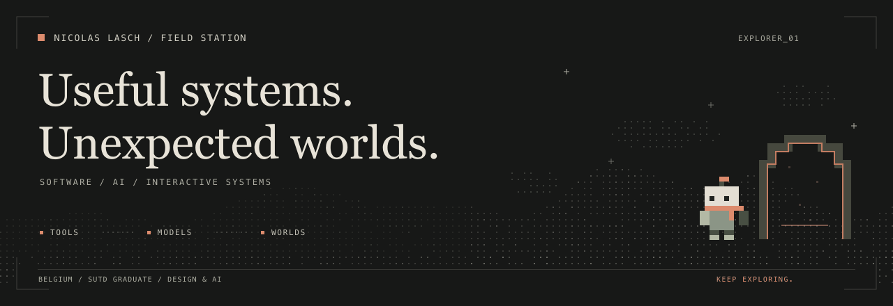
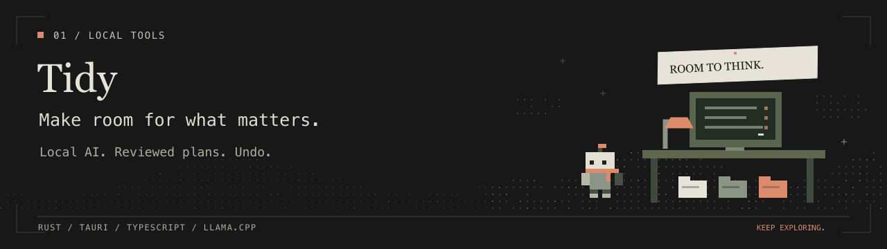
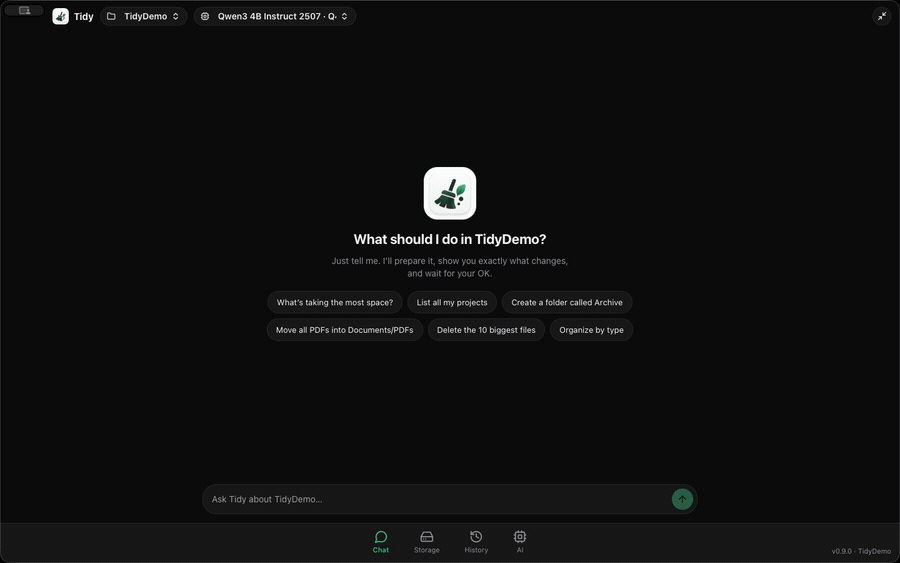
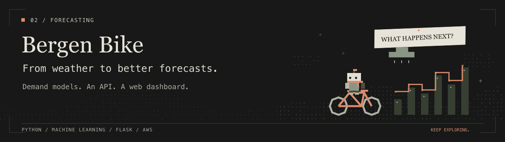
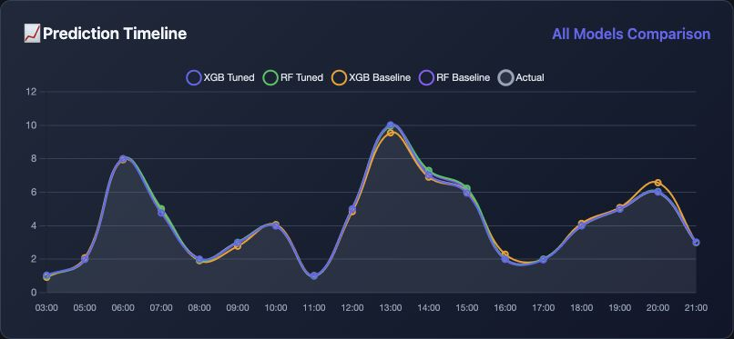
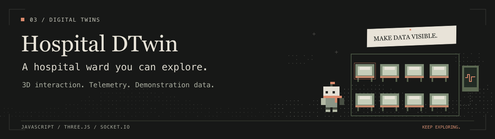
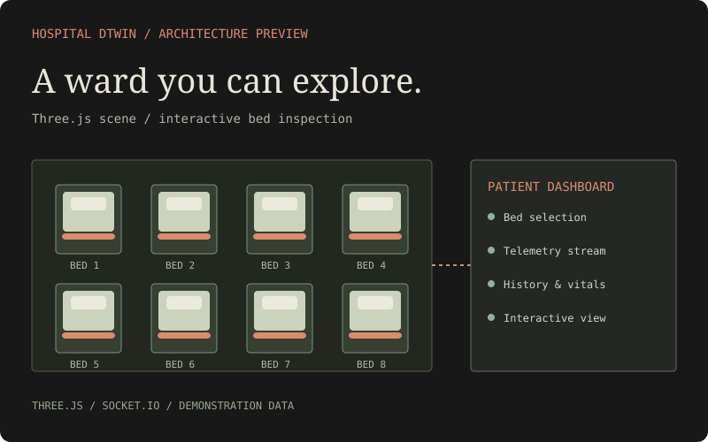
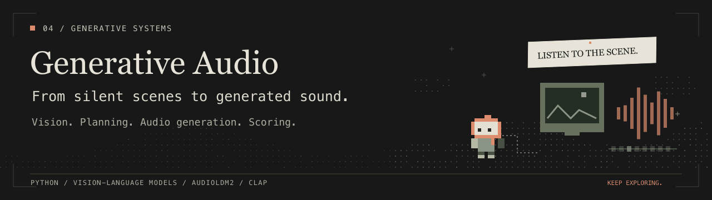
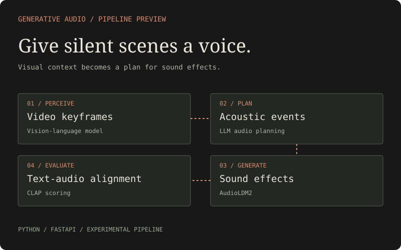
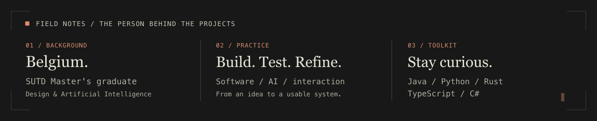

<picture>
  <source media="(prefers-reduced-motion: reduce)" srcset="./assets/hero.png">
  
</picture>

# Nicolas Lasch

**Software engineer & AI researcher.** Based in Belgium. Master's degree in Design and Artificial Intelligence, SUTD.

I build at the intersection of **software engineering, AI, and interaction design**: local AI tools, machine learning services, and multiplayer worlds. I like turning complicated systems into something people can actually use—or play.

[Explore my repositories](https://github.com/NicolasLasch?tab=repositories) · [Find me on X](https://x.com/__Spat__)

## Selected work

[Tidy](#01--tidy) · [Bergen](#02--bergen-bike-analysis) · [Hospital DTwin](#03--hospital-dtwin) · [Generative Audio](#04--generative-audio)

### 01 / Tidy

<a href="https://github.com/NicolasLasch/Tidy">
  <picture>
    <source media="(prefers-reduced-motion: reduce)" srcset="./assets/tidy-scene.png">
    
  </picture>
</a>

**A local AI assistant for your Mac's files.**

Ask in plain English, review the exact plan, and undo changes. A Rust safety engine handles execution; the optional local model helps interpret requests.

`Rust` `Tauri` `TypeScript` `llama.cpp`

[Explore the project →](https://github.com/NicolasLasch/Tidy) · [Download](https://github.com/NicolasLasch/Tidy/releases/latest)

<details>
<summary><b>Watch the real app demo</b></summary>

<a href="https://github.com/NicolasLasch/Tidy">
  <picture>
    <source media="(prefers-reduced-motion: reduce)" srcset="./assets/tidy-static.png">
    
  </picture>
</a>

</details>

### 02 / Bergen Bike Analysis

<a href="https://yfpzcgnbsf.ap-southeast-1.awsapprunner.com/">
  <picture>
    <source media="(prefers-reduced-motion: reduce)" srcset="./assets/bergen-scene.png">
    
  </picture>
</a>

**Bike-demand forecasting, beyond the notebook.**

Historical usage, time, and weather feed a prediction pipeline. A Flask API, Docker container, and AWS deployment workflow connect the model to a usable service.

`Python` `Machine learning` `Flask` `AWS`

[Try the web app →](https://yfpzcgnbsf.ap-southeast-1.awsapprunner.com/) · [Source](https://github.com/NicolasLasch/Bergen_Bike_Analysis)

<details>
<summary><b>Open the real dashboard preview</b></summary>

<a href="https://yfpzcgnbsf.ap-southeast-1.awsapprunner.com/">
  
</a>

</details>

### 03 / Hospital DTwin

<a href="https://github.com/NicolasLasch/Hospital-DTwin">
  <picture>
    <source media="(prefers-reduced-motion: reduce)" srcset="./assets/hospital-scene.png">
    
  </picture>
</a>

**A hospital ward you can explore in 3D.**

An educational digital twin with bed inspection, telemetry streams, and patient dashboards. Three.js connects spatial interaction with demonstration patient data.

`JavaScript` `Three.js` `Socket.IO`

[Explore the project →](https://github.com/NicolasLasch/Hospital-DTwin)

<details>
<summary><b>Inspect the architecture</b></summary>

<a href="https://github.com/NicolasLasch/Hospital-DTwin">
  
</a>

</details>

### 04 / Generative Audio

<a href="https://github.com/NicolasLasch/GenAI---Music-in-video">
  <picture>
    <source media="(prefers-reduced-motion: reduce)" srcset="./assets/audio-scene.png">
    
  </picture>
</a>

**From silent video to generated sound.**

An experimental pipeline combines visual scene analysis, LLM audio planning, AudioLDM2 generation, and CLAP scoring to create sound effects for video.

`Python` `Vision-language models` `AudioLDM2`

[Explore the project →](https://github.com/NicolasLasch/GenAI---Music-in-video)

<details>
<summary><b>Follow the audio pipeline</b></summary>

<a href="https://github.com/NicolasLasch/GenAI---Music-in-video">
  
</a>

</details>

## Also in the workshop

| Project | What I built |
| :--- | :--- |
| [Character Clips](https://github.com/NicolasLasch/Character-Clips) | YouTube clipping around recognized faces, using YOLOv8 and face recognition. |
| [Karmine SMP](https://github.com/NicolasLasch/Karmine-SMP-Mod) | A Forge multiplayer world with custom dimensions, portals, guild cards, and rank-based access. |
| [Farkle Dice](https://github.com/NicolasLasch/Farkle-Dice-1.21.11) | A Fabric dice game with villager opponents, betting, and player challenges. |
| [FoliaMarket](https://github.com/NicolasLasch/FoliaMarket) / [UserShops](https://github.com/NicolasLasch/UserShops) | Java plugins for server markets and player trading. |
| [NGNLUHC](https://github.com/NicolasLasch/NGNLUHC) | A No Game No Life UHC mode with custom multiplayer systems; still in development. |
| [Odoo Hackathon 4.2](https://github.com/Odoo-Hackathons-Macos-Linux/hackathon-4.2) | Collaborative development with the Macos-Linux team. |

## Field notes

<picture>
  <source media="(prefers-reduced-motion: reduce)" srcset="./assets/field-notes.png">
  
</picture>

**Languages** · Java, Python, Rust, TypeScript, C#<br>
**Across projects** · Local inference, computer vision, model serving, desktop apps, game systems.

<details>
<summary><b>Open the terminal</b></summary>

```java
package com.github.nicolaslasch;

// A small profile, in Java.
public record Profile(String name, String[] interests) {
    public static void main(String[] args) {
        var nicolas = new Profile("Nicolas Lasch", new String[] {
            "Useful tools", "Learning systems", "Unexpected worlds"
        });
        System.out.println("Ready to build: " + nicolas.name());
    }
}
```

```text
nicolas@workshop:~$ java Profile.java
Ready to build: Nicolas Lasch
nicolas@workshop:~$ _
```

</details>

---

<sub>Curious about how something works? Open a repository. The interesting part is inside.</sub>
